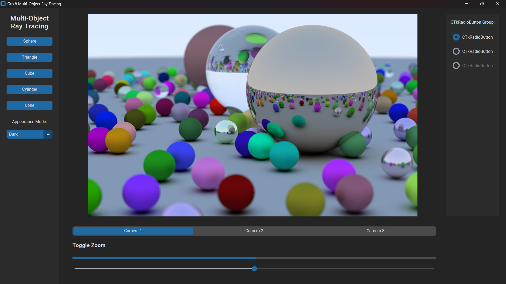
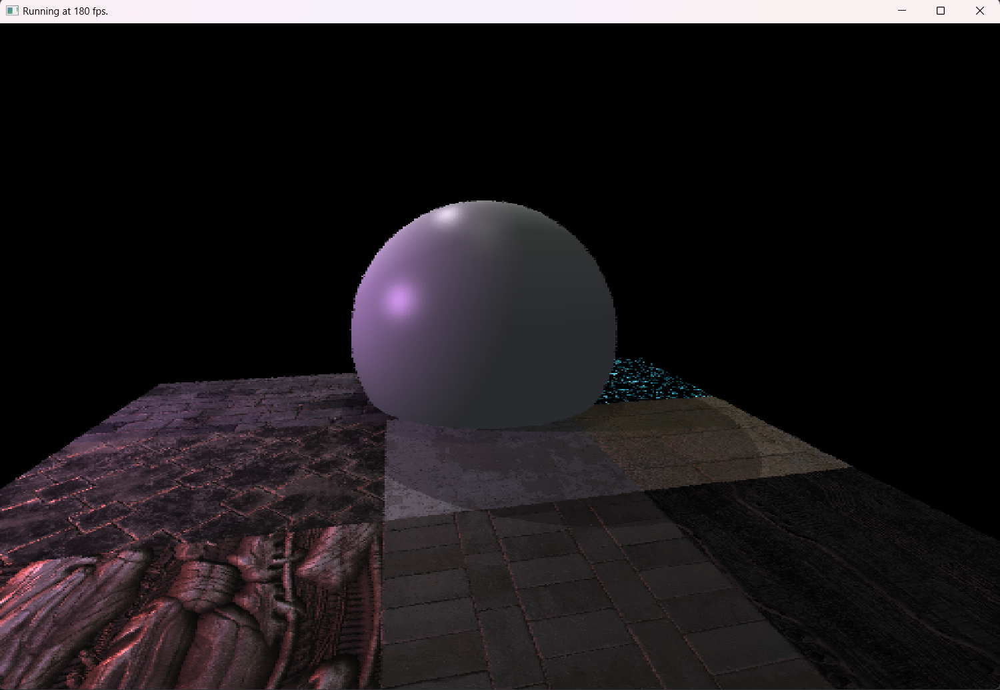

# Multi-Object Ray Tracing

## About
This project explores the implementation of ray tracing techniques on multiple objects. Leveraging principles of computer graphics, the application simulates the interaction of light rays with spherical objects, resulting in visually engaging renderings.

## Features

- Basic ray tracing on different objects.
- Interactive visualization with Matplotlib.
- Integration with specialized ray tracing and shadow libraries.

## Slides
The slides to this pitch are found [here](https://docs.google.com/presentation/d/1ZuZmtv1VgM7WAw3jpSI1SzLcU6sBZ3JmEe-7uF9YMdM/edit?usp=sharing).

## Demo
| Dashboard                                                                             | Cube                                                                             | Sphere                                                                             |
|---------------------------------------------------------------------------------------|----------------------------------------------------------------------------------|------------------------------------------------------------------------------------|
|  |  |  |


## Directory Structure

- `src`: Contains the source code.
- `tests`: Houses unit tests.
- `assets`: Stores assets such as textures or models.

## Dependencies

- Python (>=3.x)
- [NumPy](https://numpy.org/): For numerical computations.
- [Matplotlib](https://matplotlib.org/): For data visualization.
- [Taichi](https://pypi.org/project/taichi/): For high-performance numerical computation

## Local Deployment

### Step 1: Clone the Repository
```bash
git clone https://github.com/Mugambi2003/GRAPHICS-PROJECT.git`
```

### Step 2: Navigate to the project directory
```bash
cd python_ray_tracing
```

### Step 3: Install dependencies
```bash
pip install -r requirements.txt`
```

### Step 5: Run the application
```bash
python src/main.py`
```
